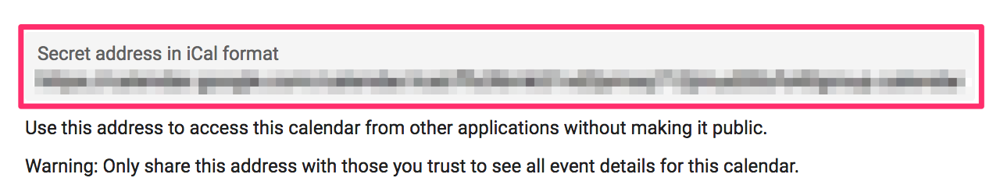

Simple time reporting based on Google Calendar.

Add `config.json` containing the configuration for the CLI.
An example `config.json` is shown below. The `calendarUrl` is can be found
in your Google calendar's settings:



```json
{
  "trello": {
    "token": "...",
    "key": "..."
  },
  "members": [
    {
      "id": "jane",
      "name": "Jane Smith",
      "calendarUrl": "https://calendar.google.com/calendar/ical/.../basic.ics"
    },
    {
      "id": "jon",
      "name": "Jonathan Grey",
      "calendarUrl": "https://calendar.google.com/calendar/ical/.../basic.ics"
    }
  ],
  "projects": [
    { "id": "abc", "boardId": "trello-id" },
    { "id": "mno", "boardId": "trello-id" },
    { "id": "xyz", "boardId": null }
  ]
}
```

You can get your Trello Key & Token by visiting
[https://trello.com/app-key](https://trello.com/app-key)
and following the instructions there.

Then you can start tracking time in your Google Calendar by adding
events with the following title structure:
`<project>:<id> <optional comment>`

* `project` is the id specified in the config's project section
* `story-id` is the (numerical) short id of the trello card or just a random string (e.g. we use `pm` for project management)
* `optional comment` can be anything, it will end up in the detailed report

Connecting Trello unlocks the "enrich" feature. Enriching the report means that the Trello card title is fetched and added to the report. For it to work you need to configure Trello access as explained above and use the cards' ids in your calendar events. You can find a card's id under "Share and more..." or just use one of the various Trello card number extensions for your favorite browser. Enrichment of a report is best used in combination with the "summary" flag.
